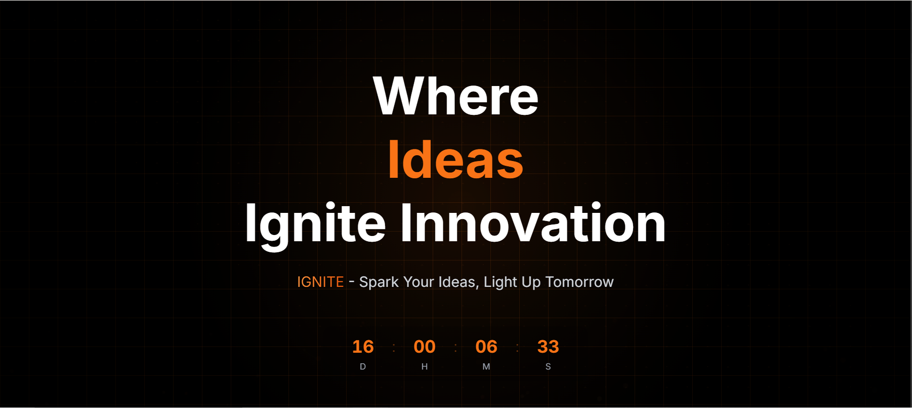

# DevImpact Hackathon Website 🚀

A modern, responsive website for the DevImpact Hackathon event, built with Next.js and TailwindCSS.



## ✨ Features

- 🎨 Modern and responsive design
- 📱 Mobile-first approach
- 🌙 Beautiful dark theme
- ⚡ Lightning-fast performance
- 📝 Easy registration process
- 📅 Interactive event timeline
- 💫 Smooth animations and transitions

## 🛠️ Tech Stack

- **Framework:** Next.js 13
- **Styling:** TailwindCSS
- **Animations:** Framer Motion
- **Form Handling:** React Hook Form
- **Icons:** Heroicons
- **Deployment:** Vercel

## 🚀 Getting Started

1. **Clone the repository**

   ```bash
   git clone https://github.com/yourusername/devimpact.git
   cd devimpact
   ```

2. **Install dependencies**

   ```bash
   npm install
   # or
   yarn install
   ```

3. **Run the development server**

   ```bash
   npm run dev
   # or
   yarn dev
   ```

4. **Open [http://localhost:3000](http://localhost:3000) in your browser**

## 📁 Project Structure

```
devimpact/
├── public/          # Static files
├── src/
│   ├── app/         # App router pages
│   ├── components/  # React components
│   ├── contexts/    # React contexts
│   ├── hooks/       # Custom hooks
│   └── utils/       # Utility functions
├── styles/          # Global styles
└── tailwind.config.js
```

## 🎨 Key Components

- **Hero Section:** Eye-catching introduction with registration CTA
- **Schedule Timeline:** Interactive event timeline with animations
- **Registration Modal:** Multi-step registration form
- **FAQ Section:** Comprehensive event information
- **Footer:** Social links and copyright information

## 🔧 Configuration

The project uses environment variables for configuration. Create a `.env.local` file:

```env
NEXT_PUBLIC_FORM_ENDPOINT=your_form_endpoint
```

## 📱 Responsive Design

The website is fully responsive and optimized for:

- Mobile devices (320px+)
- Tablets (768px+)
- Desktops (1024px+)
- Large screens (1280px+)

## ⚡ Performance

- Optimized images and assets
- Lazy loading components
- Route prefetching
- Efficient bundling

## 🤝 Contributing

1. Fork the repository
2. Create your feature branch (`git checkout -b feature/amazing-feature`)
3. Commit your changes (`git commit -m 'Add amazing feature'`)
4. Push to the branch (`git push origin feature/amazing-feature`)
5. Open a Pull Request

## 📄 License

This project is licensed under the MIT License - see the [LICENSE](LICENSE) file for details.

## 🙏 Acknowledgments

- Design inspiration from modern hackathon websites
- Icons from Heroicons
- Animations inspired by Framer Motion examples

## 🚀 Deployment

The site is automatically deployed to Vercel on every push to the main branch.

## 📞 Contact

For any questions or feedback, please reach out to [your-email@example.com](mailto:your-email@example.com)

---

Made with ❤️ by [Your Name/Team]
